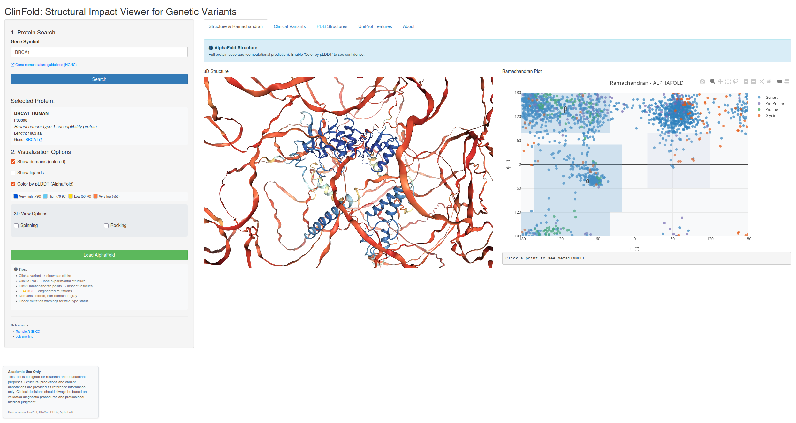

# ClinFold: Structural Impact Viewer for Genetic Variants

[](https://www.r-project.org/)
[](https://shiny.rstudio.com/)
[](https://opensource.org/licenses/MIT)
[]()
[](https://doi.org/10.5281/zenodo.18325827)

> **A tool for visualizing the structural impact of genetic variants on protein structure, integrating UniProt, ClinVar, PDBe, and AlphaFold.**

---

## Overview

**ClinFold** is a comprehensive R Shiny application designed to bridge the gap between genetic variation and structural biology. It allows researchers and clinicians to visualize where specific genetic variants (from **ClinVar**) fall within the 3D protein structure (experimentally determined by **PDBe** or predicted by **AlphaFold**).

The tool automatically maps residues between UniProt sequences and PDB structures, handling complex issues such as coverage gaps and engineered mutations.

## Published version

This app is published via shinyapps.io and can be used via https://n4n0.shinyapps.io/clinfold/.

### Key Features

* **Automated Data Retrieval**: Fetches real-time data from UniProt, ClinVar, PDBe/SIFTS, and AlphaFold DB.
* **3D Visualization**: Interactive viewing using `NGLVieweR` with support for spinning, rocking, and domain coloring.
* **Variant Mapping**: Highlights clinical variants directly on the 3D structure (sticks with element coloring).
* **Structure Profiling**:
    * **Ramachandran Plots**: Interactive plots (via `plotly`) to validate backbone geometry.
    * **AlphaFold pLDDT**: Visualization of prediction confidence scores.
    * **Mutation Warnings**: Automatically detects and warns about engineered mutations in PDB files (crystallographic artifacts).
* **UniProt Integration**: Visualizes functional domains and features directly on the structure.

---

## Screenshots



---

## Installation & Usage

You can run **ClinFold** directly from your R console. The included `run.R` script handles dependency installation automatically.

### Option 1: Quick Start (Recommended)

1.  Clone or download this repository.
2.  Open `run.R` in RStudio or your R environment.
3.  Run the script:

```r
source("run.R")
```

This script will check for missing packages (shiny, bio3d, NGLVieweR, etc.), install them if necessary, and launch the application.

### Option 2: Manual Launch

Ensure you have the following packages installed:

```r
install.packages(c("shiny", "httr", "jsonlite", "dplyr", "tibble", "DT", 
                   "bio3d", "purrr", "glue", "stringr", "ggplot2", 
                   "plotly", "NGLVieweR"))
```

Then run the app:

```r
library(shiny)
runApp("app.R")
```

---

## Data Sources

ClinFold aggregates data from the following authoritative sources:

- UniProt: Protein sequences and functional annotations.

- ClinVar: Clinical significance of genetic variants.

- PDBe & SIFTS: Experimental structures and residue-level mapping.

- AlphaFold DB: High-accuracy protein structure predictions.

---

## References

If you use this tool or the Ramachandran plot functionality, please consider the following references:

- RamplotR: BiKC/RamplotR GitHub

- pdb-profiling: Eigenblog - Introduce pdb-profiling

---

## Contact & Disclaimer

Academic Use Only: This tool is designed for research and educational purposes. Structural predictions and annotations are for reference only.

Author: Fernando de la Puente Alonso de la Torre

Email: UO257655@uniovi.es | puentealonsode@gmail.com
